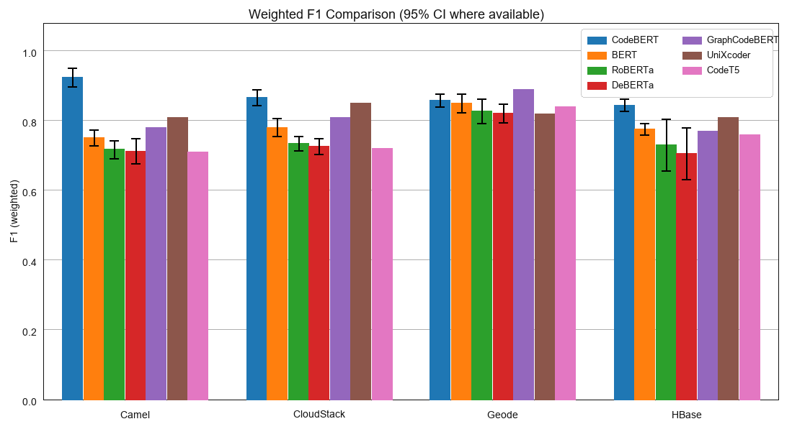
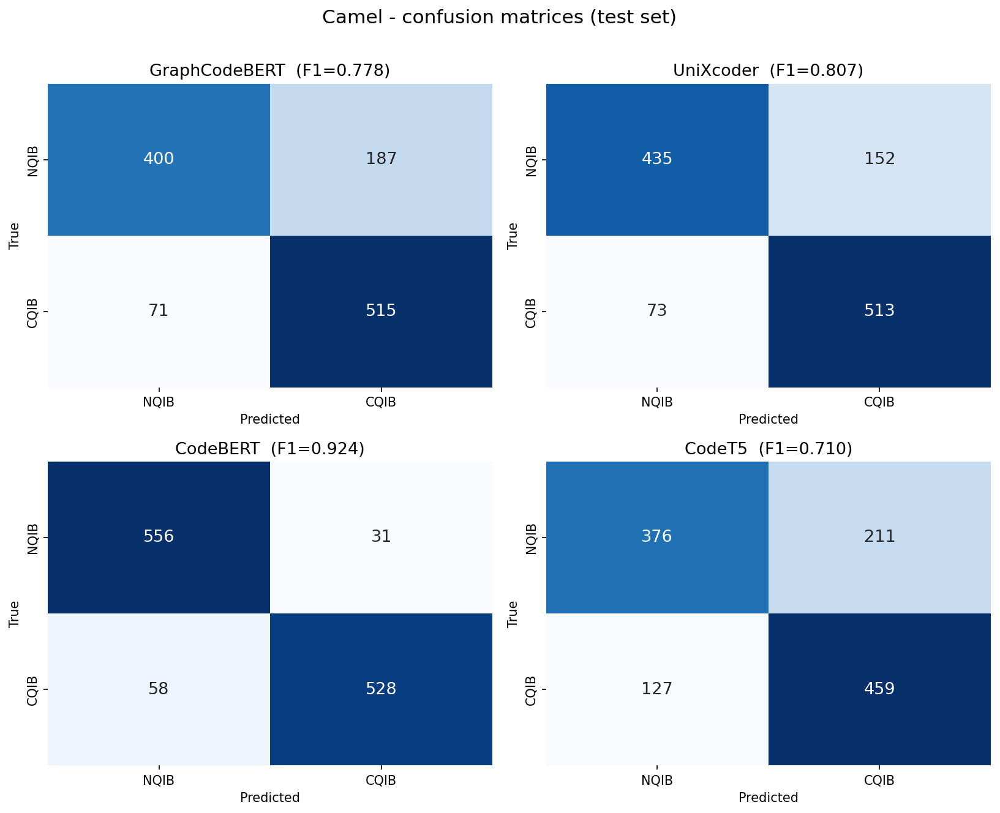

# Automated-Bug-Report-Classification-to-Improve-Source-Code-Quality

This repository contains the code and resources for the research on automatically classifying software bug reports to predict their potential impact on source code quality, using fine-tuned code-pretrained transformer models. The goal is to identify "Code Quality Impacting Bugs" (CQIBs) versus "Non-Code-Quality-Impacting Bugs" (NQIBs) proactively.

## Abstract

Maintaining high source code quality is crucial. Bug fixes, while necessary, can inadvertently introduce code smells, degrading quality. This project proposes a CodeBERT-based model to automatically classify bug reports into CQIBs and NQIBs. We fine-tuned CodeBERT using a continual learning approach on a dataset comprising over 25,000 balanced bug report entries from four Apache projects (Geode, CloudStack, Camel, and HBase). Our model achieved a final accuracy of 91.21%, significantly outperforming prior baseline studies. To confirm that these gains stem from code-aware pre-training rather than the transformer architecture alone, we additionally compare against general-purpose encoders (BERT, RoBERTa, DeBERTa) and other code-pretrained models (GraphCodeBERT, UniXcoder, CodeT5).

## Project Structure

-   `train.py`: Entry point for fine-tuning (continual, combined, and code-model comparison).
-   `test.py`: Inference / evaluation on held-out data.
-   `configs/model_config.yaml`: Model, training, data, and testing configuration.
-   `src/`:
    -   `Utils.py`: Preprocessing, class balancing, tokenizer loading, and training-argument construction.
    -   `dataset.py`: `BugReportDataset` and train/validation dataset construction.
    -   `metrics.py`: Accuracy / F1 / precision / recall and confusion-matrix plotting.
-   `notebook/`:
    -   `BugClassification.ipynb`: Main CodeBERT implementation (preprocessing, fine-tuning, evaluation).
    -   `BugClassification_All_Bert_Models.ipynb`: CodeBERT vs. BERT / RoBERTa / DeBERTa benchmark.
    -   `BugClassification_Code_Models.ipynb`: Code-pretrained comparison (GraphCodeBERT, UniXcoder, CodeT5) with consolidated results and visualizations.
-   `images/`: Figures used in the paper / README (confusion matrices, F1 comparison, metric bars).
-   `requirements.txt`, `README.md`, `LICENSE`.

## Code-Pretrained Model Comparison

Beyond the general-purpose encoders, we evaluate three additional **code-pretrained** models to isolate the effect of code-aware pre-training. These three were fine-tuned on a single stratified 80/10/10 split (best-F1 early stopping, 10 epochs); CodeBERT's row shows its 5-fold cross-validated result for reference (a lighter protocol is used for the three additions, so their point estimates carry no confidence interval).

| Model | Params | Type | Camel | CloudStack | Geode | HBase | Avg. F1 |
|-------|:------:|------|:-----:|:----------:|:-----:|:-----:|:-------:|
| GraphCodeBERT | 125M | encoder | 0.778 | 0.809 | **0.891** | 0.766 | 0.811 |
| UniXcoder | 126M | encoder | 0.807 | 0.851 | 0.822 | 0.806 | 0.822 |
| CodeT5 | 220M | encoder–decoder | 0.710 | 0.715 | 0.837 | 0.756 | 0.755 |
| CodeBERT (5-fold CV, ref.) | 125M | encoder | 0.924 | 0.866 | 0.858 | 0.845 | 0.873 |

All values are weighted-F1 on the held-out test set. CodeT5 is a T5 encoder–decoder: it is unstable in fp16 (train in **bf16** on Ampere+ GPUs or fp32 elsewhere) and needs more GPU memory than the encoders (it exceeded a 40 GB A100 at batch 32 and was trained on a 96 GB GPU). See `notebook/BugClassification_Code_Models.ipynb` for the full runs and reproducible visualizations.



Per-project confusion matrices (GraphCodeBERT, UniXcoder, CodeBERT, CodeT5):



## Features

-   **Advanced Text Preprocessing:** URL normalization, code-token splitting, punctuation cleaning, and stopword removal that preserves code-relevant terms.
-   **Code-Model Fine-Tuning:** Fine-tuning for binary sequence classification of `microsoft/codebert-base`, `microsoft/graphcodebert-base`, `microsoft/unixcoder-base`, and `Salesforce/codet5-base`, plus general-purpose baselines.
-   **Data Handling:** Loading from multiple CSVs, cleaning/NaN handling, class balancing via upsampling, and stratified splitting.
-   **Training Strategies:**
    1.  **Continual Learning:** Model trained sequentially on accumulating project datasets.
    2.  **Individual Learning:** Separate models trained per project dataset.
    3.  **Code-Model Comparison:** Each code-pretrained model fine-tuned per project with model-specific precision/batch settings.
-   **Robust Tokenizer Loading:** A 3-tier fallback loads legacy checkpoints (e.g. CodeT5) whose extra sentinel tokens trip newer `tokenizers`.
-   **Evaluation:** Accuracy, F1, precision, recall, and confusion matrices.

## Requirements

-   Python 3.x, Pandas, NumPy, Scikit-learn, PyTorch
-   Hugging Face Transformers, Datasets, Evaluate
-   `sentencepiece` + `protobuf` (for the CodeT5 / UniXcoder tokenizers)
-   NLTK (for `punkt` and `stopwords`)
-   Matplotlib & Seaborn (for visualization)

```bash
pip install -r requirements.txt
```
Then download NLTK resources:
```python
import nltk
nltk.download('punkt'); nltk.download('stopwords')
```

## Usage

1.  **Dataset:** Place the project CSVs (`Camel_DE - v.02.csv`, `CloudStack_DE - v.01.csv`, `Geode_DE - v.01.csv`, `Hbase_DE - v.01.csv`) in your data directory and point `data.data_dir` in `configs/model_config.yaml` to it. Each CSV has two columns — `text` and `label` (0 = NQIB, 1 = CQIB), no header.
2.  **Train:** Configure `configs/model_config.yaml` and run:
    ```bash
    python -m train        # learning: 'Continual' | 'Combined' | 'CodeModels'
    ```
3.  **Notebooks:** For the transformer/code-model comparisons and their visualizations, run the notebooks in `notebook/`. `BugClassification_Code_Models.ipynb` reproduces the consolidated summary table, F1 heatmap, metric bars, and confusion matrices on CPU (the recorded results are embedded).

## Citation

If you use this work, please cite the associated thesis/paper:
```
[]
```

## License

This research is based on a master's thesis at NUST University; use for academic research purposes only.
